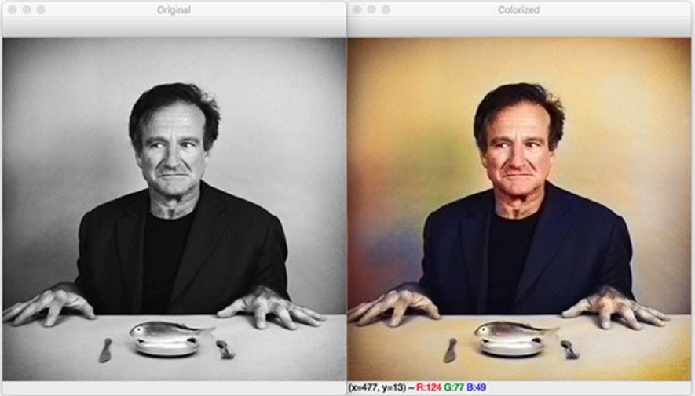

<!-- Project 1 -->
<!-- Name -->
##  [Premier League Predictor](pl_predictor) 

<!-- Thumbnail -->
<!--  -->

<!-- GitHub Link -->
[Github Link](https://github.com/SankalpMehani/premier_league_predictor)

<!-- Project 2 -->
<!-- Name -->
##  [Image Colorization with DCGAN](image-colorization-with-dcgan) 

<!-- Thumbnail -->
<!--  -->

<!-- GitHub Link -->
[Github Link](https://github.com/SankalpMehani/Image-Colorization-DCGAN)

<!-- ## Using Hydejack
* [Basics]{:.heading.flip-title} --- How to add different types of content.
* [Writing]{:.heading.flip-title} --- Producing markdown content for Hydejack.
* [Scripts]{:.heading.flip-title} --- How to include 3rd party scripts on your site.
* [Build]{:.heading.flip-title} --- How to build the static files for deployment.
* [Advanced]{:.heading.flip-title} --- Guides for more advanced tasks.
{:.related-posts.faded}

## Other
* [LICENSE]{:.heading.flip-title} --- The license of this project.
* [NOTICE]{:.heading.flip-title} --- Parts of this program are provided under separate licenses.
* [CHANGELOG]{:.heading.flip-title} --- Version history of Hydejack.
{:.related-posts.faded}

[install]: install.md
[upgrade]: upgrade.md
[config]: config.md
[basics]: basics.md
[writing]: writing.md
[scripts]: scripts.md
[build]: build.md
[advanced]: advanced.md
[LICENSE]: ../LICENSE.md
[NOTICE]: ../NOTICE.md
[CHANGELOG]: ../CHANGELOG.md -->

<!-- 
[checkout]: pl_predictor.md
[]: pl_predictor -->
