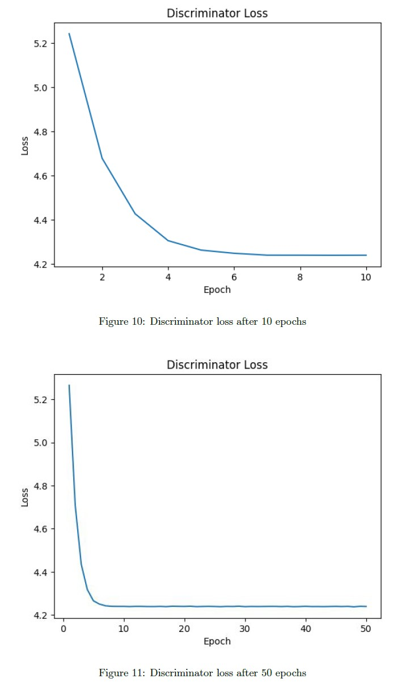
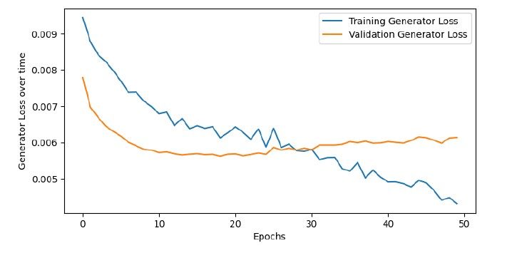
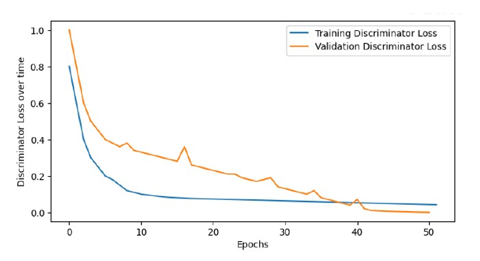

# Automatic Image Colorization with DCGAN and U-Net

This repository contains the code and documentation for our CSE 676 Deep Learning final project, which focuses on automatic image colorization using Deep Convolutional Generative Adversarial Networks (DCGAN) and a modified U-Net architecture.

## Table of Contents
- [Automatic Image Colorization with DCGAN and U-Net](#automatic-image-colorization-with-dcgan-and-u-net)
  - [Table of Contents](#table-of-contents)
  - [Problem Statement](#problem-statement)
  - [Dataset](#dataset)
  - [Architecture 1](#architecture-1)
    - [Generator and Discriminator](#generator-and-discriminator)
  - [Architecture 2](#architecture-2)
    - [Generator and Discriminator](#generator-and-discriminator-1)
  - [Architecture 3](#architecture-3)
  - [Training](#training)
  - [Results](#results)
  - [Project Management Tracker](#project-management-tracker)
  - [References](#references)

## Problem Statement

This project aims to develop a DCGAN model for automatic colorization of grayscale images. Colorization enhances the visual appeal and interpretability of grayscale images and has applications in image restoration, historical photo colorization, and artistic rendering. We explored multiple architectures and training strategies to improve the accuracy of the model.

## Dataset

I used the popular CIFAR-10 dataset, consisting of 50,000 RGB images for training and 10,000 for testing. These RGB images were converted to the LAB color space, with the L channel as the generator input and the AB channels as the discriminator target.

## Architecture 1

### Generator and Discriminator
The DCGAN consists of two key components:
- Generator: Transforms grayscale images into colorized versions.
- Discriminator: Distinguishes between real and generated color images.
Both models were trained using the Adam optimizer with BCELoss as the loss criterion.

<!-- 

 -->

Generator Loss            |  Discriminator Loss
:-------------------------:|:-------------------------:
  |  

## Architecture 2

### Generator and Discriminator
This DCGAN variant features a Generator with 26 layers and a Discriminator with 17 layers. Training was conducted for 50 epochs.

Generator Loss            |  Discriminator Loss
:-------------------------:|:-------------------------:
  |  

## Architecture 3

Implemented an autoencoder with a modified U-Net architecture for image colorization.

## Training

Training details for each architecture are provided in the report. Training times varied, with most models converging within a reasonable timeframe.

## Results

Evaluated the colorization performance of each architecture and included sample results in the report.

## Project Management Tracker

Used a project management tracker to keep track of our progress and tasks. A snapshot of the tracker is available in the report.

## References

Links to relevant articles, tutorials, and papers used for reference in the project.

For more detailed information, refer to the full [project report](https://github.com/SankalpMehani/Image-Colorization-DCGAN/blob/main/README.md).

Feel free to explore the code and experiment with different models for automatic image colorization!
